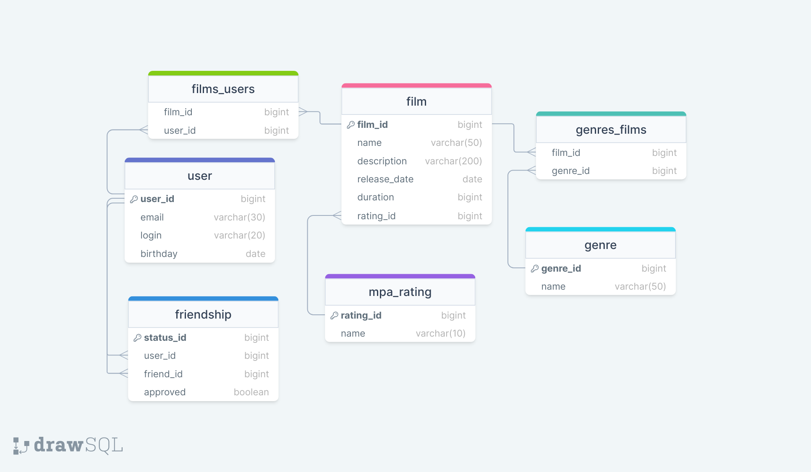

# java-filmorate
Template repository for Filmorate project.

База данных приложения состоит из 7 таблиц:

+ films – содержит сведения о фильмах;
+ films_genres - содержит связи между фильмами и жанрами;
+ genres – содержит справочник жанров фильмов;
+ mpa_ratings – содержит справочник рейтинга Ассоциации кинокомпаний;
+ films_users - содержит связи между фильмами и пользователями (лайки)
+ users – содержит сведения о пользователях;
+ friendship – содержит сведения о дружбе пользователей.

